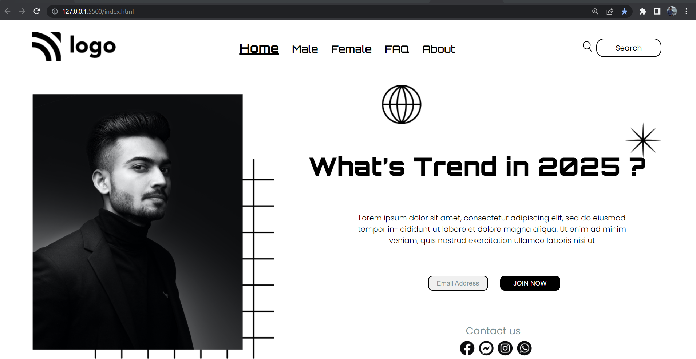

# Hi, I'm Venkatesh Koppar

## Things Learnt In this project:

1. Positions
2. Z-index
3. Margin
4. Padding

## Experience gained from this project:
I was able to apply css styles by linking external style sheet. 
Was able to use concepts of css like selectors which are used to target a particular class or a element. Got handson experience on using properties like margins, padding,borders etc.   

## Project Link
https://street-style-site.netlify.app/

## Time taken to complete this project:
6.5hrs

### Techonology used:
1. HTML
2. CSS

### Softwares used:

